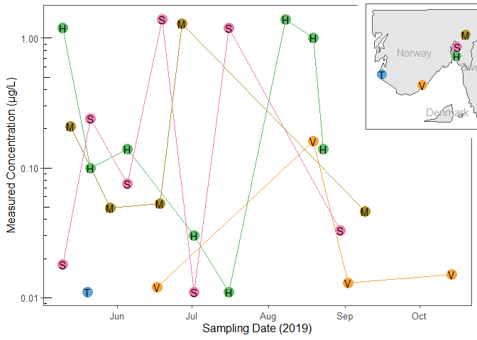
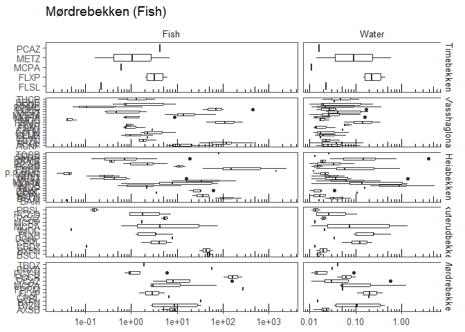
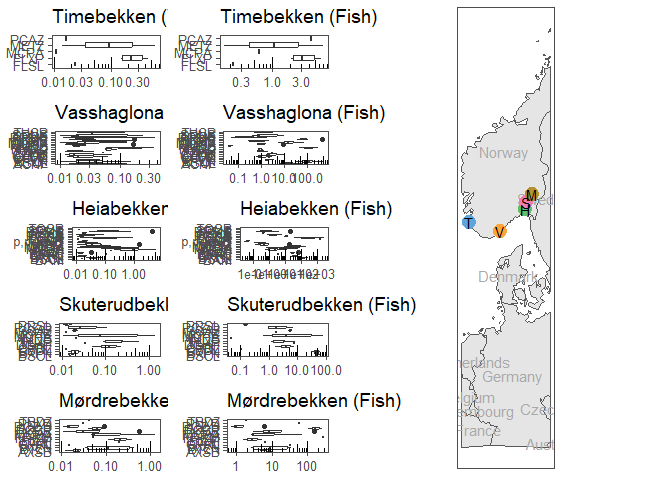

# README.md
Sam A. Welch
2024-05-09

- [Setup](#setup)
  - [Data](#data)
- [Task A: Import and Visualise Spatiotemporal Exposure
  Data](#task-a-import-and-visualise-spatiotemporal-exposure-data)
- [Task B: Predict tissue concentrations of chemicals in
  fish](#task-b-predict-tissue-concentrations-of-chemicals-in-fish)
- [Task C: Visualize the values of Cw and Cf on a
  map](#task-c-visualize-the-values-of-cw-and-cf-on-a-map)

## Setup

<details class="code-fold">
<summary>Show code</summary>

``` r
library(tidyverse)  # tidyverse packages for data cleaning, graphs, etc. 
library(webchem)    # access to chemical database APIs
library(readxl)     # read Excel files
library(sf)         # handle geographical data sets
library(maps)       # default maps of the world
library(csmaps)     # maps of Norway
library(giscoR) # more maps
library(cowplot) # plots in grids
library(ggthemes) # colour palettes

options(knitr.kable.NA = '-')
```

</details>

### Data

<details class="code-fold">
<summary>Show code</summary>

``` r
# Get a map of Europe and crop it to Norway
gisco_Europe <- gisco_get_countries(epsg = 4326, region = "Europe") |> 
      st_crop(xmin = 5, xmax = 13, ymin = 57, ymax = 61) 

gisco_Europe_zoom <- gisco_get_countries(epsg = 4326, region = "Europe") |> 
      st_crop(xmin = 5, xmax = 13, ymin = 48, ymax = 72) 

sites_sf <- st_as_sf(sites, coords = c("LONGITUDE", "LATITUDE"), crs = 4326) |> 
  select(-COORDINATE_SYSTEM, -SITE_CODE)
```

</details>

## Task A: Import and Visualise Spatiotemporal Exposure Data

We can find some better plots for this later.

Todo: Pick a unique icon and colour for each site, use throughout

<details class="code-fold">
<summary>Show code</summary>

``` r
# Sampling Map
plot_a0 <- ggplot(gisco_Europe) +
  geom_sf() +
  geom_sf(data = sites_sf) +
  geom_sf_text(aes(label = NAME_ENGL), colour = "darkgrey") +
      geom_sf(data = sites_sf, aes(size = 5, colour = SITE_NAME)) +
  geom_sf_text(data = sites_sf, aes(label = c("T", "V", "H", "S", "M"))) +
  theme(legend.position = "none", axis.title = element_blank(), axis.ticks = element_blank(), axis.text = element_blank()) +
      scale_color_few()

# Spatial Variation

plot_a1 <- mcpa_exposure %>% 
  ggplot(mapping = aes(x = SITE_NAME, y = MEASURED_VALUE, colour = SITE_NAME)) +
  geom_boxplot() +
    scale_y_log10() +
  scale_color_few() +
  labs(x = "Sampling Site",
       y = "Measured Concentration (μg/L)",
       colour = "Sampling Site",
       shape = "Sampling Site")

# Temporal Variation

plot_a2 <- mcpa_exposure %>% 
  ggplot(mapping = aes(x = SAMPLE_DATE, y = MEASURED_VALUE, group = floor_date(SAMPLE_DATE, unit = "months"))) +
  geom_boxplot() +
    scale_y_log10() +
  labs(x = "Sampling Date",
       y = "Measured Concentration (μg/L)",
       colour = "Sampling Site",
       shape = "Sampling Site")

# Spatio-Temporal Variation

plot_a3 <- mcpa_exposure %>%
  ggplot(mapping = aes(x = SAMPLE_DATE, y = MEASURED_VALUE, colour = SITE_NAME)) +
  geom_line() +
  geom_point(size = 5) +
  geom_text(aes(label = SITE_NAME |> substr(start = 1, stop = 1)), colour = "black") +
  scale_y_log10() +
  scale_color_few() +
  labs(
    x = "Sampling Date (2019)",
    y = "Measured Concentration (μg/L)",
    colour = "Sampling Site",
    shape = "Sampling Site"
  ) +
  theme(legend.position = "none") +
   annotation_logticks(sides = "l")

# task_a_plot <- plot_grid(plot_a3, plot_a0,
#           ncol = 2, rel_widths = c(3, 1))

task_a_plot <- ggdraw(plot = plot_a3) +
  draw_plot(plot_a0, x = 0.8, y = 0.65, width = 0.2, height = 0.3, scale = 1.5)
task_a_plot
```

</details>



## Task B: Predict tissue concentrations of chemicals in fish

Any outliers?

How to calculate some of these :(?

Also how to make nice tables in quarto?

<details class="code-fold">
<summary>Show code</summary>

``` r
all_data_summary <- 
all_data %>% 
  group_by(SITE_NAME, STRESSOR_NAME) %>% 
  summarise(Mean_MEASURED_VALUE = mean(MEASURED_VALUE),
            SD_MEASURED_VALUE = sd(MEASURED_VALUE),
            Max_MEASURED_VALUE = max(MEASURED_VALUE),
            Min_MEASURED_VALUE = min(MEASURED_VALUE),
            perc_5_MEASURED_VALUE = quantile(MEASURED_VALUE, probs = 0.05),
            perc_95_MEASURED_VALUE = quantile(MEASURED_VALUE, probs = 0.95)) |> 
  transmute(SITE_NAME,
            STRESSOR_NAME,
            Mean_SD = case_when(is.na(SD_MEASURED_VALUE) ~ 
                                  paste0(Mean_MEASURED_VALUE |> round(2), "*"),
                              TRUE ~ 
                                  paste0(Mean_MEASURED_VALUE |> round(2), " ± ", SD_MEASURED_VALUE |> round(2))
                             ),
            Max_MEASURED_VALUE,
            Min_MEASURED_VALUE,
            perc_5_MEASURED_VALUE,
            perc_95_MEASURED_VALUE
         )

# Make a table using knitr
task_b_table <- knitr::kable(all_data_summary, digits = 2,
             col.names = c("Site", "Stressor", "Mean ± SD", "Min.", "Max.", "5th Percentile", "95th Percentile"),
              caption = "Table of mean, standard deviation, maximum, minimum and percentile values of measured concentrations of 48 chemical stressors across 6 freshwater sampling sites in Norway, May 6th to October 28th 2019. *: <i>n</i> too small to calculate standard deviation. All values in μg/L, rounded to 2 d.p.")
```

</details>
<details>
<summary>Show Table 1: Summary Statistics of Stressor Concentrations</summary>

| Site           | Stressor                                               | Mean ± SD   | Min. | Max. | 5th Percentile | 95th Percentile |
|:---------------|:-------------------------------------------------------|:------------|-----:|-----:|---------------:|----------------:|
| Timebekken     | 2-methyl-4-chlorophenoxyacetic acid (MCPA)             | 0.01\*      | 0.01 | 0.01 |           0.01 |            0.01 |
| Timebekken     | florasulam                                             | 0.02\*      | 0.02 | 0.02 |           0.02 |            0.02 |
| Timebekken     | fluroxypyr                                             | 0.28 ± 0.15 | 0.46 | 0.15 |           0.15 |            0.44 |
| Timebekken     | metribuzin                                             | 0.3 ± 0.41  | 0.59 | 0.01 |           0.04 |            0.56 |
| Timebekken     | propiconazole                                          | 0.02\*      | 0.02 | 0.02 |           0.02 |            0.02 |
| Vasshaglona    | 2-methyl-4-chlorophenoxyacetic acid (MCPA)             | 0.05 ± 0.07 | 0.16 | 0.01 |           0.01 |            0.14 |
| Vasshaglona    | aclonifen                                              | 0.05 ± 0.05 | 0.13 | 0.01 |           0.01 |            0.12 |
| Vasshaglona    | bentazone                                              | 0.03 ± 0.01 | 0.04 | 0.02 |           0.02 |            0.04 |
| Vasshaglona    | boscalid                                               | 0.05 ± 0.04 | 0.15 | 0.01 |           0.01 |            0.13 |
| Vasshaglona    | chlorfenvinphos                                        | 0.02\*      | 0.02 | 0.02 |           0.02 |            0.02 |
| Vasshaglona    | clomazone                                              | 0.03 ± 0.03 | 0.06 | 0.01 |           0.01 |            0.06 |
| Vasshaglona    | cyazofamid                                             | 0.05\*      | 0.05 | 0.05 |           0.05 |            0.05 |
| Vasshaglona    | cyprodinil                                             | 0.03 ± 0.03 | 0.07 | 0.01 |           0.01 |            0.07 |
| Vasshaglona    | fenamidone                                             | 0.21 ± 0.21 | 0.36 | 0.06 |           0.07 |            0.34 |
| Vasshaglona    | fludioxonil                                            | 0.02 ± 0.01 | 0.04 | 0.01 |           0.01 |            0.03 |
| Vasshaglona    | fluroxypyr                                             | 0.07 ± 0.02 | 0.09 | 0.06 |           0.06 |            0.08 |
| Vasshaglona    | imidacloprid                                           | 0.02 ± 0.01 | 0.03 | 0.02 |           0.02 |            0.03 |
| Vasshaglona    | mandipropamid                                          | 0.04 ± 0.04 | 0.13 | 0.01 |           0.01 |            0.11 |
| Vasshaglona    | metribuzin                                             | 0.08 ± 0.07 | 0.19 | 0.02 |           0.02 |            0.18 |
| Vasshaglona    | pencycuron                                             | 0.05 ± 0.06 | 0.17 | 0.01 |           0.01 |            0.13 |
| Vasshaglona    | propamocarb                                            | 0.1 ± 0.15  | 0.37 | 0.01 |           0.01 |            0.31 |
| Vasshaglona    | pyridafol                                              | 0.08 ± 0.1  | 0.24 | 0.01 |           0.01 |            0.22 |
| Vasshaglona    | spinosad                                               | 0.03\*      | 0.03 | 0.03 |           0.03 |            0.03 |
| Vasshaglona    | thiacloprid                                            | 0.07 ± 0.07 | 0.12 | 0.02 |           0.02 |            0.11 |
| Heiabekken     | 1,1’-(2,2-Dichloro-1,1-ethenediyl)bis(4-chlorobenzene) | 0.01\*      | 0.01 | 0.01 |           0.01 |            0.01 |
| Heiabekken     | 2,6-dichlorobenzamide (BAM)                            | 0.02\*      | 0.02 | 0.02 |           0.02 |            0.02 |
| Heiabekken     | 2-methyl-4-chlorophenoxyacetic acid (MCPA)             | 0.5 ± 0.59  | 1.40 | 0.01 |           0.02 |            1.33 |
| Heiabekken     | bixafen                                                | 0.02 ± 0.01 | 0.02 | 0.01 |           0.01 |            0.02 |
| Heiabekken     | boscalid                                               | 0.04 ± 0.02 | 0.08 | 0.02 |           0.02 |            0.07 |
| Heiabekken     | clopyralid                                             | 0.11\*      | 0.11 | 0.11 |           0.11 |            0.11 |
| Heiabekken     | diflufenican                                           | 0.02 ± 0.01 | 0.03 | 0.01 |           0.01 |            0.03 |
| Heiabekken     | fluroxypyr                                             | 0.16\*      | 0.16 | 0.16 |           0.16 |            0.16 |
| Heiabekken     | imidacloprid                                           | 1.14 ± 1.38 | 5.30 | 0.21 |           0.23 |            3.10 |
| Heiabekken     | mandipropamid                                          | 0.15 ± 0.19 | 0.36 | 0.01 |           0.02 |            0.33 |
| Heiabekken     | metalaxyl                                              | 0.03 ± 0.02 | 0.06 | 0.01 |           0.01 |            0.06 |
| Heiabekken     | metamitron                                             | 0.02 ± 0.01 | 0.03 | 0.01 |           0.01 |            0.03 |
| Heiabekken     | metribuzin                                             | 0.18 ± 0.43 | 1.40 | 0.01 |           0.01 |            0.81 |
| Heiabekken     | pencycuron                                             | 0.18 ± 0.26 | 0.93 | 0.01 |           0.02 |            0.61 |
| Heiabekken     | propamocarb                                            | 0.52 ± 1.14 | 3.90 | 0.03 |           0.03 |            2.34 |
| Heiabekken     | propoxycarbazone                                       | 0.02 ± 0    | 0.02 | 0.02 |           0.02 |            0.02 |
| Heiabekken     | prothioconazole-desthio                                | 0.04 ± 0.03 | 0.09 | 0.01 |           0.01 |            0.08 |
| Heiabekken     | pyraclostrobin                                         | 0.02 ± 0.01 | 0.02 | 0.01 |           0.01 |            0.02 |
| Heiabekken     | spinosad                                               | 0.01\*      | 0.01 | 0.01 |           0.01 |            0.01 |
| Heiabekken     | trifloxystrobin                                        | 0.03\*      | 0.03 | 0.03 |           0.03 |            0.03 |
| Skuterudbekken | 2-methyl-4-chlorophenoxyacetic acid (MCPA)             | 0.43 ± 0.61 | 1.40 | 0.01 |           0.01 |            1.34 |
| Skuterudbekken | bixafen                                                | 0.02 ± 0.01 | 0.03 | 0.01 |           0.01 |            0.03 |
| Skuterudbekken | boscalid                                               | 0.02 ± 0    | 0.02 | 0.01 |           0.01 |            0.02 |
| Skuterudbekken | carbendazim                                            | 0.01\*      | 0.01 | 0.01 |           0.01 |            0.01 |
| Skuterudbekken | clopyralid                                             | 0.13 ± 0.08 | 0.23 | 0.05 |           0.06 |            0.22 |
| Skuterudbekken | dichlorprop                                            | 0.04\*      | 0.04 | 0.04 |           0.04 |            0.04 |
| Skuterudbekken | fluroxypyr                                             | 0.26 ± 0.21 | 0.60 | 0.09 |           0.09 |            0.53 |
| Skuterudbekken | imidacloprid                                           | 0.02\*      | 0.02 | 0.02 |           0.02 |            0.02 |
| Skuterudbekken | mecoprop                                               | 0.01\*      | 0.01 | 0.01 |           0.01 |            0.01 |
| Skuterudbekken | propiconazole                                          | 0.02 ± 0    | 0.02 | 0.02 |           0.02 |            0.02 |
| Skuterudbekken | prothioconazole-desthio                                | 0.05 ± 0.05 | 0.11 | 0.01 |           0.01 |            0.10 |
| Skuterudbekken | pyroxsulam                                             | 0.01 ± 0    | 0.02 | 0.01 |           0.01 |            0.02 |
| Mørdrebekken   | 2-methyl-4-chlorophenoxyacetic acid (MCPA)             | 0.33 ± 0.55 | 1.30 | 0.05 |           0.05 |            1.08 |
| Mørdrebekken   | azoxystrobin                                           | 0.02 ± 0.01 | 0.03 | 0.01 |           0.01 |            0.03 |
| Mørdrebekken   | bentazone                                              | 0.21 ± 0.2  | 0.43 | 0.03 |           0.03 |            0.41 |
| Mørdrebekken   | bixafen                                                | 0.01\*      | 0.01 | 0.01 |           0.01 |            0.01 |
| Mørdrebekken   | clopyralid                                             | 0.2\*       | 0.20 | 0.20 |           0.20 |            0.20 |
| Mørdrebekken   | fenpropimorph                                          | 0.05\*      | 0.05 | 0.05 |           0.05 |            0.05 |
| Mørdrebekken   | fluroxypyr                                             | 0.25 ± 0.2  | 0.39 | 0.11 |           0.12 |            0.38 |
| Mørdrebekken   | pencycuron                                             | 0.07 ± 0.04 | 0.10 | 0.04 |           0.04 |            0.10 |
| Mørdrebekken   | pinoxaden                                              | 0.03\*      | 0.03 | 0.03 |           0.03 |            0.03 |
| Mørdrebekken   | propiconazole                                          | 0.16 ± 0.28 | 0.58 | 0.01 |           0.01 |            0.50 |
| Mørdrebekken   | prothioconazole-desthio                                | 0.03 ± 0.04 | 0.09 | 0.01 |           0.01 |            0.08 |
| Mørdrebekken   | thiabendazole                                          | 0.04\*      | 0.04 | 0.04 |           0.04 |            0.04 |

Table of mean, standard deviation, maximum, minimum and percentile
values of measured concentrations of 48 chemical stressors across 6
freshwater sampling sites in Norway, May 6th to October 28th 2019. \*:
<i>n</i> too small to calculate standard deviation. All values in μg/L,
rounded to 2 d.p.

</details>
<details class="code-fold">
<summary>Show code</summary>

``` r
# Try and import the (already downloaded and saved) chem properties, try importing if it doesn't work
try_import_webchem <- try(webchem_chemicals <- read_csv(file = "data/webchem_chemical_data.csv"))
```

</details>

    Rows: 40 Columns: 6
    ── Column specification ────────────────────────────────────────────────────────
    Delimiter: ","
    chr (3): STRESSOR_NAME, CAS, INCHIKEY
    dbl (3): STRESSOR_ID, CID, XLogP

    ℹ Use `spec()` to retrieve the full column specification for this data.
    ℹ Specify the column types or set `show_col_types = FALSE` to quiet this message.

<details class="code-fold">
<summary>Show code</summary>

``` r
if (inherits(x = try_import_webchem, what = "try-error")) {
  print("Chemical data not found, importing from Pubchem via Webchem.")
  # Get the relevant CIDs from InChiKeys, then look up LogKOW/XLogP on Pubchem
  webchem_chemicals <- all_stressors |> 
  mutate(CID = get_cid(INCHIKEY, from = "inchikey", match = "first")$cid,
         XLogP = pc_prop(CID, properties = "XLogP")$XLogP)
  # Save to data to avoid unecessary API calls
  write_csv(x = webchem_chemicals, file = "data/webchem_chemical_data.csv")
}

# Predict tissue concentration in fish for all chemicals and sites
Cf_all_stressors <- all_data |> 
  left_join(webchem_chemicals |> select(-STRESSOR_ID, -INCHIKEY, -CAS), by = "STRESSOR_NAME") |> 
  mutate(FISH_CONC_uGKG = MEASURED_VALUE * 10 ^ (0.76 * XLogP - 0.23))

# Make a table summarising mean concentrations in fish by site and stressor
Cf_summary <- Cf_all_stressors |> 
    group_by(SITE_NAME, STRESSOR_NAME) %>% 
  summarise(Mean_MEASURED_VALUE = mean(MEASURED_VALUE),
            SD_MEASURED_VALUE = sd(MEASURED_VALUE)) |> 
  transmute(SITE_NAME,
            STRESSOR_NAME,
            Mean_SD = case_when(is.na(SD_MEASURED_VALUE) ~ 
                                  paste0(Mean_MEASURED_VALUE |> round(2), "*"),
                              TRUE ~ 
                                  paste0(Mean_MEASURED_VALUE |> round(2), " ± ", SD_MEASURED_VALUE |> round(2))
                             )
         ) |> 
  pivot_wider(values_from = Mean_SD, names_from = SITE_NAME)
```

</details>

    `summarise()` has grouped output by 'SITE_NAME'. You can override using the
    `.groups` argument.

<details class="code-fold">
<summary>Show code</summary>

``` r
# Make a pretty table using knitr
Cf_summary_table <- knitr::kable(Cf_summary, digits = 2,
             col.names = c("Stressor", "Heiabekken", "Mørdrebekken", "Skuterudbekken", "Timebekken", "Vasshaglona"),
              caption = "Table of mean and standard deviation of measured concentrations of 48 chemical stressors across 6 freshwater sampling sites in Norway, May 6th to October 28th 2019. *: n too small to calculate standard deviation. All values in μg/L.")
```

</details>
<details>
<summary>Show Table 2: Cf_summary_table</summary>

| Stressor                                               | Heiabekken  | Mørdrebekken | Skuterudbekken | Timebekken  | Vasshaglona |
|:-------------------------------------------------------|:------------|:-------------|:---------------|:------------|:------------|
| 2-methyl-4-chlorophenoxyacetic acid (MCPA)             | 0.01\*      | 0.05 ± 0.07  | 0.5 ± 0.59     | 0.43 ± 0.61 | 0.33 ± 0.55 |
| florasulam                                             | 0.02\*      | \-           | \-             | \-          | \-          |
| fluroxypyr                                             | 0.28 ± 0.15 | 0.07 ± 0.02  | 0.16\*         | 0.26 ± 0.21 | 0.25 ± 0.2  |
| metribuzin                                             | 0.3 ± 0.41  | 0.08 ± 0.07  | 0.18 ± 0.43    | \-          | \-          |
| propiconazole                                          | 0.02\*      | \-           | \-             | 0.02 ± 0    | 0.16 ± 0.28 |
| aclonifen                                              | \-          | 0.05 ± 0.05  | \-             | \-          | \-          |
| bentazone                                              | \-          | 0.03 ± 0.01  | \-             | \-          | 0.21 ± 0.2  |
| boscalid                                               | \-          | 0.05 ± 0.04  | 0.04 ± 0.02    | 0.02 ± 0    | \-          |
| chlorfenvinphos                                        | \-          | 0.02\*       | \-             | \-          | \-          |
| clomazone                                              | \-          | 0.03 ± 0.03  | \-             | \-          | \-          |
| cyazofamid                                             | \-          | 0.05\*       | \-             | \-          | \-          |
| cyprodinil                                             | \-          | 0.03 ± 0.03  | \-             | \-          | \-          |
| fenamidone                                             | \-          | 0.21 ± 0.21  | \-             | \-          | \-          |
| fludioxonil                                            | \-          | 0.02 ± 0.01  | \-             | \-          | \-          |
| imidacloprid                                           | \-          | 0.02 ± 0.01  | 1.14 ± 1.38    | 0.02\*      | \-          |
| mandipropamid                                          | \-          | 0.04 ± 0.04  | 0.15 ± 0.19    | \-          | \-          |
| pencycuron                                             | \-          | 0.05 ± 0.06  | 0.18 ± 0.26    | \-          | 0.07 ± 0.04 |
| propamocarb                                            | \-          | 0.1 ± 0.15   | 0.52 ± 1.14    | \-          | \-          |
| pyridafol                                              | \-          | 0.08 ± 0.1   | \-             | \-          | \-          |
| spinosad                                               | \-          | 0.03\*       | 0.01\*         | \-          | \-          |
| thiacloprid                                            | \-          | 0.07 ± 0.07  | \-             | \-          | \-          |
| 1,1’-(2,2-Dichloro-1,1-ethenediyl)bis(4-chlorobenzene) | \-          | \-           | 0.01\*         | \-          | \-          |
| 2,6-dichlorobenzamide (BAM)                            | \-          | \-           | 0.02\*         | \-          | \-          |
| bixafen                                                | \-          | \-           | 0.02 ± 0.01    | 0.02 ± 0.01 | 0.01\*      |
| clopyralid                                             | \-          | \-           | 0.11\*         | 0.13 ± 0.08 | 0.2\*       |
| diflufenican                                           | \-          | \-           | 0.02 ± 0.01    | \-          | \-          |
| metalaxyl                                              | \-          | \-           | 0.03 ± 0.02    | \-          | \-          |
| metamitron                                             | \-          | \-           | 0.02 ± 0.01    | \-          | \-          |
| propoxycarbazone                                       | \-          | \-           | 0.02 ± 0       | \-          | \-          |
| prothioconazole-desthio                                | \-          | \-           | 0.04 ± 0.03    | 0.05 ± 0.05 | 0.03 ± 0.04 |
| pyraclostrobin                                         | \-          | \-           | 0.02 ± 0.01    | \-          | \-          |
| trifloxystrobin                                        | \-          | \-           | 0.03\*         | \-          | \-          |
| carbendazim                                            | \-          | \-           | \-             | 0.01\*      | \-          |
| dichlorprop                                            | \-          | \-           | \-             | 0.04\*      | \-          |
| mecoprop                                               | \-          | \-           | \-             | 0.01\*      | \-          |
| pyroxsulam                                             | \-          | \-           | \-             | 0.01 ± 0    | \-          |
| azoxystrobin                                           | \-          | \-           | \-             | \-          | 0.02 ± 0.01 |
| fenpropimorph                                          | \-          | \-           | \-             | \-          | 0.05\*      |
| pinoxaden                                              | \-          | \-           | \-             | \-          | 0.03\*      |
| thiabendazole                                          | \-          | \-           | \-             | \-          | 0.04\*      |

Table of mean and standard deviation of measured concentrations of 48
chemical stressors across 6 freshwater sampling sites in Norway, May 6th
to October 28th 2019. \*: n too small to calculate standard deviation.
All values in μg/L.

</details>

## Task C: Visualize the values of Cw and Cf on a map

<details class="code-fold">
<summary>Show code</summary>

``` r
task_c_data <- Cf_all_stressors |>
  left_join(sites_sf, by = "SITE_NAME") |>
  left_join(all_stressors, by = "STRESSOR_NAME") |>
  pivot_longer(cols = c(MEASURED_VALUE, FISH_CONC_uGKG), names_to = "Media", values_to = "Stressor_ug") |>
  mutate(Media = case_when(
    Media == "MEASURED_VALUE" ~ "Water",
    TRUE ~ "Fish"
  ))

task_c_map <-
  ggplot(gisco_Europe_zoom) +
  geom_sf() +
  geom_sf(data = sites_sf) +
  geom_sf_text(aes(label = NAME_ENGL), colour = "darkgrey") +
  geom_sf(data = sites_sf, aes(size = 5, colour = SITE_NAME)) +
  geom_sf_text(data = sites_sf, aes(label = c("T", "V", "H", "S", "M"))) +
  theme(legend.position = "none", axis.title = element_blank(), axis.ticks = element_blank(), axis.text = element_blank()) +
      scale_color_few()

task_c_plot_list <- vector("list", 10)
n <- 0


for (site in sites$SITE_NAME) {
  for (medium in c("Water", "Fish")) {
    n <- n + 1
    temp_data <- task_c_data |> filter(Media == medium)
    temp_plot <- temp_data |>
      filter(SITE_NAME == site) |>
      ggplot(aes(x = Stressor_ug, y = STRESSOR_ACRONYM)) +
      geom_boxplot() +
      scale_x_log10() +
      labs(
        x = "Measured Concentration (μg/L)",
        y = "Stressor (Abbreviated)",
        title = paste0(site, " (", medium, ")")
      ) +
      annotation_logticks(sides = "b") +
      theme(axis.title = element_blank())
    task_c_plot_list[[n]] <- temp_plot
  }
}

#try facets instead
ggplot(data = task_c_data, mapping = aes(x = Stressor_ug, y = STRESSOR_ACRONYM)) +
      geom_boxplot() +
      scale_x_log10() +
      labs(
        x = "Measured Concentration (μg/L)",
        y = "Stressor (Abbreviated)",
        title = paste0(site, " (", medium, ")")
      ) +
      annotation_logticks(sides = "b") +
      theme(axis.title = element_blank()) +
  facet_grid(SITE_NAME ~ Media, scales = "free", space = "free_x")
```

</details>



<details class="code-fold">
<summary>Show code</summary>

``` r
# y.grob <- textGrob("Stressor", 
#                    gp=gpar(fontface="bold", fontsize=15), rot=90)
# 
# x.grob <- textGrob("Concentration (μg/L)", 
#                    gp=gpar(fontface="bold", fontsize=15))

task_c_boxplots <- plot_grid(
  plotlist = task_c_plot_list,
  nrow = 5, ncol = 2, axis = "lrtb"
)
plot_grid(task_c_boxplots, task_c_map, ncol = 2, nrow = 1, rel_width = c(2, 1))
```

</details>


