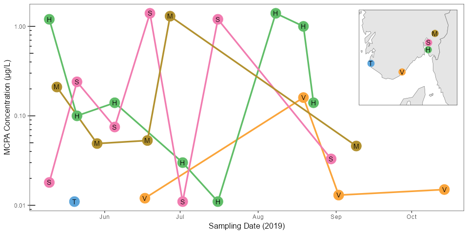

# README.md
Sam A. Welch
2024-05-09

N.B: For an up to date copy of the interview presentation, please go to /docs/

- [Setup](#setup)
  - [Data](#data)
- [Task A: Import and Visualise Spatiotemporal Exposure
  Data](#task-a-import-and-visualise-spatiotemporal-exposure-data)
- [Task B: Predict tissue concentrations of chemicals in
  fish](#task-b-predict-tissue-concentrations-of-chemicals-in-fish)
- [Task C: Visualize the values of Cw and Cf on a
  map](#task-c-visualize-the-values-of-cw-and-cf-on-a-map)

This README.md file is a rendering of the .qmd document of the same
name, written as part of the coding task for a postdoctoral position at
NIVA. All code is my own work. The (indirect) assistance of the authors
of the below packages in completing this project is gratefully
acknowledged. This project was created using R version 4.4.0, and may
not run properly under other versions.

## Setup

<details class="code-fold">
<summary>Show code</summary>

``` r
library(tidyverse)  # tidyverse packages for data cleaning, graphs, etc. 
library(webchem)    # access to chemical database APIs
library(readxl)     # read Excel files
library(sf)         # GIS functions
library(giscoR)     # Eurostat maps
library(cowplot)    # plots in grids
library(ggthemes)   # colour palettes

options(knitr.kable.NA = '-')
knitr::opts_chunk$set(dev = "ragg_png")
```

</details>

### Data

Data provided as part of the assignment is loaded and processed below.
In addition, a .csv of abbreviated stressor names (author’s own work,
and not based on any standardised practice) created for this assignment
is loaded in.

Code chunks and tables have been placed in collapsible elements to
improve document readability. Click the “▶ Show code” (or similar)
button to show the section.

Next, maps of Europe from the `giscoR` package are loaded and cropped to
the relevant area, and the provided site data is converted to an `sf`
object for compatibility with `sf`’s GIS functions.

<details class="code-fold">
<summary>Show code</summary>

``` r
# Get a map of Europe
gisco_Europe <- gisco_get_countries(epsg = 4326, region = "Europe") 

sites_sf <- st_as_sf(sites, coords = c("LONGITUDE", "LATITUDE"), crs = 4326) |> 
  select(-COORDINATE_SYSTEM, -SITE_CODE)
```

</details>

## Task A: Import and Visualise Spatiotemporal Exposure Data

Measured concentrations for 40 stressors across 5 sites were imported.
Concentrations of 2-methyl-4-chlorophenoxyacetic acid (MCPA), a phenoyx
herbicide, were measured over a 5-month period in 2019, 1-8 times, site
depending. Data were plotted as a scatter plot/line graph to show
spatial (site) and temporal (sampling date) variation.

<details class="code-fold">
<summary>Show code</summary>

``` r
# Sampling Map
plot_a0 <- ggplot(gisco_Europe) +
  geom_sf() +
  geom_sf(data = sites_sf) +
  geom_sf_text(aes(label = NAME_ENGL), colour = "darkgrey") +
      geom_sf(data = sites_sf, aes(size = 6, colour = SITE_NAME)) +
  geom_sf_text(data = sites_sf, aes(label = c("T", "V", "H", "S", "M"))) +
  theme(legend.position = "none", axis.title = element_blank(), axis.ticks = element_blank(), axis.text = element_blank()) +
      scale_color_few() +
  coord_sf(xlim = c(5, 13), ylim = c(57, 61))

plot_a1 <- mcpa_exposure %>%
  ggplot(mapping = aes(x = SAMPLE_DATE, y = MEASURED_VALUE, colour = SITE_NAME)) +
  geom_line(size = 1.2) +
  geom_point(size = 7) +
  geom_text(aes(label = SITE_NAME |> substr(start = 1, stop = 1)), colour = "black") +
  scale_y_log10() +
  scale_color_few() +
  labs(
    x = "Sampling Date (2019)",
    y = "MCPA Concentration (μg/L)",
    colour = "Sampling Site",
    shape = "Sampling Site"
  ) +
  theme(legend.position = "none") +
   annotation_logticks(sides = "l")

task_a_plot <- ggdraw(plot = plot_a1) +
  draw_plot(plot_a0, x = 0.77, y = 0.6, width = 0.2, height = 0.3, scale = 1.5)
task_a_plot
```

</details>



Figure 1: Line graph/scatter plot of measured concentrations of
2-methyl-4-chlorophenoxyacetic acid (MCPA) in 5 freshwater sampling
sites in Norway, between May 5th and October 14th, 2019. Each point
represents a single sample. Inset map shows locations of sampling sites
(T)imebekken, (V)asshaglona, (H)eiabekken, (S)kuterudbekken, and
(M)ørdrebekken.

## Task B: Predict tissue concentrations of chemicals in fish

Summary statistics (mean, standard deviation, maximum, minimum, and
5th/95th percentiles) were calculated for each combination of site and
stressor across the sampling period.

<details class="code-fold">
<summary>Show code</summary>

``` r
all_data_summary <- 
all_data %>% 
  group_by(SITE_NAME, STRESSOR_NAME) %>% 
  summarise(n_MEASURED_VALUE = n(),
            Mean_MEASURED_VALUE = mean(MEASURED_VALUE),
            SD_MEASURED_VALUE = sd(MEASURED_VALUE),
            Max_MEASURED_VALUE = max(MEASURED_VALUE),
            Min_MEASURED_VALUE = min(MEASURED_VALUE),
            perc_5_MEASURED_VALUE = quantile(MEASURED_VALUE, probs = 0.05),
            perc_95_MEASURED_VALUE = quantile(MEASURED_VALUE, probs = 0.95)) |> 
  transmute(SITE_NAME,
            STRESSOR_NAME,
            n_MEASURED_VALUE,
            Mean_SD = case_when(is.na(SD_MEASURED_VALUE) ~ 
                                  paste0(Mean_MEASURED_VALUE |> round(2), "*"),
                              TRUE ~ 
                                  paste0(Mean_MEASURED_VALUE |> round(2), " ± ", SD_MEASURED_VALUE |> round(2))
                             ),
            Max_MEASURED_VALUE,
            Min_MEASURED_VALUE,
            perc_5_MEASURED_VALUE,
            perc_95_MEASURED_VALUE
         )

# Make a table using knitr
task_b_table <- knitr::kable(all_data_summary, digits = 2,
             col.names = c("Site", "Stressor", "n", "Mean ± SD", "Min.", "Max.", "5th Percentile", "95th Percentile"))
```

</details>
<details>
<summary>Show Table 1: Summary statistics of measured stressor concentrations in water</summary>

| Site           | Stressor                                               |   n | Mean ± SD   | Min. | Max. | 5th Percentile | 95th Percentile |
|:---------------|:-------------------------------------------------------|----:|:------------|-----:|-----:|---------------:|----------------:|
| Timebekken     | 2-methyl-4-chlorophenoxyacetic acid (MCPA)             |   1 | 0.01\*      | 0.01 | 0.01 |           0.01 |            0.01 |
| Timebekken     | florasulam                                             |   1 | 0.02\*      | 0.02 | 0.02 |           0.02 |            0.02 |
| Timebekken     | fluroxypyr                                             |   4 | 0.28 ± 0.15 | 0.46 | 0.15 |           0.15 |            0.44 |
| Timebekken     | metribuzin                                             |   2 | 0.3 ± 0.41  | 0.59 | 0.01 |           0.04 |            0.56 |
| Timebekken     | propiconazole                                          |   1 | 0.02\*      | 0.02 | 0.02 |           0.02 |            0.02 |
| Vasshaglona    | 2-methyl-4-chlorophenoxyacetic acid (MCPA)             |   4 | 0.05 ± 0.07 | 0.16 | 0.01 |           0.01 |            0.14 |
| Vasshaglona    | aclonifen                                              |   4 | 0.05 ± 0.05 | 0.13 | 0.01 |           0.01 |            0.12 |
| Vasshaglona    | bentazone                                              |   9 | 0.03 ± 0.01 | 0.04 | 0.02 |           0.02 |            0.04 |
| Vasshaglona    | boscalid                                               |  12 | 0.05 ± 0.04 | 0.15 | 0.01 |           0.01 |            0.13 |
| Vasshaglona    | chlorfenvinphos                                        |   1 | 0.02\*      | 0.02 | 0.02 |           0.02 |            0.02 |
| Vasshaglona    | clomazone                                              |   3 | 0.03 ± 0.03 | 0.06 | 0.01 |           0.01 |            0.06 |
| Vasshaglona    | cyazofamid                                             |   1 | 0.05\*      | 0.05 | 0.05 |           0.05 |            0.05 |
| Vasshaglona    | cyprodinil                                             |   3 | 0.03 ± 0.03 | 0.07 | 0.01 |           0.01 |            0.07 |
| Vasshaglona    | fenamidone                                             |   2 | 0.21 ± 0.21 | 0.36 | 0.06 |           0.07 |            0.34 |
| Vasshaglona    | fludioxonil                                            |   3 | 0.02 ± 0.01 | 0.04 | 0.01 |           0.01 |            0.03 |
| Vasshaglona    | fluroxypyr                                             |   3 | 0.07 ± 0.02 | 0.09 | 0.06 |           0.06 |            0.08 |
| Vasshaglona    | imidacloprid                                           |   3 | 0.02 ± 0.01 | 0.03 | 0.02 |           0.02 |            0.03 |
| Vasshaglona    | mandipropamid                                          |   6 | 0.04 ± 0.04 | 0.13 | 0.01 |           0.01 |            0.11 |
| Vasshaglona    | metribuzin                                             |   8 | 0.08 ± 0.07 | 0.19 | 0.02 |           0.02 |            0.18 |
| Vasshaglona    | pencycuron                                             |   7 | 0.05 ± 0.06 | 0.17 | 0.01 |           0.01 |            0.13 |
| Vasshaglona    | propamocarb                                            |   5 | 0.1 ± 0.15  | 0.37 | 0.01 |           0.01 |            0.31 |
| Vasshaglona    | pyridafol                                              |   5 | 0.08 ± 0.1  | 0.24 | 0.01 |           0.01 |            0.22 |
| Vasshaglona    | spinosad                                               |   1 | 0.03\*      | 0.03 | 0.03 |           0.03 |            0.03 |
| Vasshaglona    | thiacloprid                                            |   2 | 0.07 ± 0.07 | 0.12 | 0.02 |           0.02 |            0.11 |
| Heiabekken     | 1,1’-(2,2-Dichloro-1,1-ethenediyl)bis(4-chlorobenzene) |   1 | 0.01\*      | 0.01 | 0.01 |           0.01 |            0.01 |
| Heiabekken     | 2,6-dichlorobenzamide (BAM)                            |   1 | 0.02\*      | 0.02 | 0.02 |           0.02 |            0.02 |
| Heiabekken     | 2-methyl-4-chlorophenoxyacetic acid (MCPA)             |   8 | 0.5 ± 0.59  | 1.40 | 0.01 |           0.02 |            1.33 |
| Heiabekken     | bixafen                                                |   4 | 0.02 ± 0.01 | 0.02 | 0.01 |           0.01 |            0.02 |
| Heiabekken     | boscalid                                               |  12 | 0.04 ± 0.02 | 0.08 | 0.02 |           0.02 |            0.07 |
| Heiabekken     | clopyralid                                             |   1 | 0.11\*      | 0.11 | 0.11 |           0.11 |            0.11 |
| Heiabekken     | diflufenican                                           |   5 | 0.02 ± 0.01 | 0.03 | 0.01 |           0.01 |            0.03 |
| Heiabekken     | fluroxypyr                                             |   1 | 0.16\*      | 0.16 | 0.16 |           0.16 |            0.16 |
| Heiabekken     | imidacloprid                                           |  12 | 1.14 ± 1.38 | 5.30 | 0.21 |           0.23 |            3.10 |
| Heiabekken     | mandipropamid                                          |   3 | 0.15 ± 0.19 | 0.36 | 0.01 |           0.02 |            0.33 |
| Heiabekken     | metalaxyl                                              |   9 | 0.03 ± 0.02 | 0.06 | 0.01 |           0.01 |            0.06 |
| Heiabekken     | metamitron                                             |   5 | 0.02 ± 0.01 | 0.03 | 0.01 |           0.01 |            0.03 |
| Heiabekken     | metribuzin                                             |  10 | 0.18 ± 0.43 | 1.40 | 0.01 |           0.01 |            0.81 |
| Heiabekken     | pencycuron                                             |  12 | 0.18 ± 0.26 | 0.93 | 0.01 |           0.02 |            0.61 |
| Heiabekken     | propamocarb                                            |  11 | 0.52 ± 1.14 | 3.90 | 0.03 |           0.03 |            2.34 |
| Heiabekken     | propoxycarbazone                                       |   4 | 0.02 ± 0    | 0.02 | 0.02 |           0.02 |            0.02 |
| Heiabekken     | prothioconazole-desthio                                |   8 | 0.04 ± 0.03 | 0.09 | 0.01 |           0.01 |            0.08 |
| Heiabekken     | pyraclostrobin                                         |   2 | 0.02 ± 0.01 | 0.02 | 0.01 |           0.01 |            0.02 |
| Heiabekken     | spinosad                                               |   1 | 0.01\*      | 0.01 | 0.01 |           0.01 |            0.01 |
| Heiabekken     | trifloxystrobin                                        |   1 | 0.03\*      | 0.03 | 0.03 |           0.03 |            0.03 |
| Skuterudbekken | 2-methyl-4-chlorophenoxyacetic acid (MCPA)             |   7 | 0.43 ± 0.61 | 1.40 | 0.01 |           0.01 |            1.34 |
| Skuterudbekken | bixafen                                                |   3 | 0.02 ± 0.01 | 0.03 | 0.01 |           0.01 |            0.03 |
| Skuterudbekken | boscalid                                               |   3 | 0.02 ± 0    | 0.02 | 0.01 |           0.01 |            0.02 |
| Skuterudbekken | carbendazim                                            |   1 | 0.01\*      | 0.01 | 0.01 |           0.01 |            0.01 |
| Skuterudbekken | clopyralid                                             |   4 | 0.13 ± 0.08 | 0.23 | 0.05 |           0.06 |            0.22 |
| Skuterudbekken | dichlorprop                                            |   1 | 0.04\*      | 0.04 | 0.04 |           0.04 |            0.04 |
| Skuterudbekken | fluroxypyr                                             |   5 | 0.26 ± 0.21 | 0.60 | 0.09 |           0.09 |            0.53 |
| Skuterudbekken | imidacloprid                                           |   1 | 0.02\*      | 0.02 | 0.02 |           0.02 |            0.02 |
| Skuterudbekken | mecoprop                                               |   1 | 0.01\*      | 0.01 | 0.01 |           0.01 |            0.01 |
| Skuterudbekken | propiconazole                                          |   2 | 0.02 ± 0    | 0.02 | 0.02 |           0.02 |            0.02 |
| Skuterudbekken | prothioconazole-desthio                                |   4 | 0.05 ± 0.05 | 0.11 | 0.01 |           0.01 |            0.10 |
| Skuterudbekken | pyroxsulam                                             |   2 | 0.01 ± 0    | 0.02 | 0.01 |           0.01 |            0.02 |
| Mørdrebekken   | 2-methyl-4-chlorophenoxyacetic acid (MCPA)             |   5 | 0.33 ± 0.55 | 1.30 | 0.05 |           0.05 |            1.08 |
| Mørdrebekken   | azoxystrobin                                           |   4 | 0.02 ± 0.01 | 0.03 | 0.01 |           0.01 |            0.03 |
| Mørdrebekken   | bentazone                                              |   4 | 0.21 ± 0.2  | 0.43 | 0.03 |           0.03 |            0.41 |
| Mørdrebekken   | bixafen                                                |   1 | 0.01\*      | 0.01 | 0.01 |           0.01 |            0.01 |
| Mørdrebekken   | clopyralid                                             |   1 | 0.2\*       | 0.20 | 0.20 |           0.20 |            0.20 |
| Mørdrebekken   | fenpropimorph                                          |   1 | 0.05\*      | 0.05 | 0.05 |           0.05 |            0.05 |
| Mørdrebekken   | fluroxypyr                                             |   2 | 0.25 ± 0.2  | 0.39 | 0.11 |           0.12 |            0.38 |
| Mørdrebekken   | pencycuron                                             |   2 | 0.07 ± 0.04 | 0.10 | 0.04 |           0.04 |            0.10 |
| Mørdrebekken   | pinoxaden                                              |   1 | 0.03\*      | 0.03 | 0.03 |           0.03 |            0.03 |
| Mørdrebekken   | propiconazole                                          |   4 | 0.16 ± 0.28 | 0.58 | 0.01 |           0.01 |            0.50 |
| Mørdrebekken   | prothioconazole-desthio                                |   4 | 0.03 ± 0.04 | 0.09 | 0.01 |           0.01 |            0.08 |
| Mørdrebekken   | thiabendazole                                          |   1 | 0.04\*      | 0.04 | 0.04 |           0.04 |            0.04 |

</details>

Table 1: Table of mean, standard deviation, maximum, minimum and
percentile values of measured concentrations of 48 chemical stressors
across 6 freshwater sampling sites in Norway, May 6th to October 28th
2019. \*: <i>n</i> too small to calculate standard deviation. All values
in μg/L, rounded to 2 d.p.

Tissue concentrations of stressors in fish were calculated as follows.
First, the R package `webchem` was used to assign PubChem IDs to the
stressors based on InChIKeys. These IDs were subsequently used to look
up LogKOW (a.k.a XLogP) values on PubChem, which were available as
predicted values for 39 substances, but not for spinosad. These values
were then used to predict tissue concentrations following the equation:

$$C_f = C_w \times 10^{0.76 \times logP - 0.23}$$

Tissue concentration data is subsequently saved to
`/data/Cf_summary_table.csv` and displayed below.

<details class="code-fold">
<summary>Show code</summary>

``` r
# Try and import the (already downloaded and saved) chem properties, try importing if it doesn't work
try_import_webchem <- try(webchem_chemicals <- read_csv(file = "data/webchem_chemical_data.csv"))
if (inherits(x = try_import_webchem, what = "try-error")) {
  print("Chemical data not found, importing from Pubchem via Webchem.")
  # Get the relevant CIDs from InChiKeys, then look up LogKOW/XLogP on Pubchem
  webchem_chemicals <- all_stressors |> 
  mutate(CID = get_cid(INCHIKEY, from = "inchikey", match = "first")$cid,
         XLogP = pc_prop(CID, properties = "XLogP")$XLogP)
  # Save to data to avoid unecessary API calls
  write_csv(x = webchem_chemicals, file = "data/webchem_chemical_data.csv")
}

# Predict tissue concentration in fish for all chemicals and sites
Cf_all_stressors <- all_data |> 
  left_join(webchem_chemicals |> select(-STRESSOR_ID, -INCHIKEY, -CAS), by = "STRESSOR_NAME") |> 
  mutate(FISH_CONC_uGKG = MEASURED_VALUE * 10 ^ (0.76 * XLogP - 0.23))

# Make a table summarising mean concentrations in fish by site and stressor
Cf_summary <- Cf_all_stressors |> 
    group_by(SITE_NAME, STRESSOR_NAME) %>% 
  summarise(Mean_MEASURED_VALUE = mean(MEASURED_VALUE),
            SD_MEASURED_VALUE = sd(MEASURED_VALUE)) |> 
  transmute(SITE_NAME,
            STRESSOR_NAME,
            Mean_SD = case_when(is.na(SD_MEASURED_VALUE) ~ 
                                  paste0(Mean_MEASURED_VALUE |> round(2), "*"),
                              TRUE ~ 
                                  paste0(Mean_MEASURED_VALUE |> round(2), " ± ", SD_MEASURED_VALUE |> round(2))
                             )
         ) |> 
  pivot_wider(values_from = Mean_SD, names_from = SITE_NAME)

# Make a pretty table using knitr
Cf_summary_table <- knitr::kable(Cf_summary, digits = 2,
             col.names = c("Stressor", "Heiabekken", "Mørdrebekken", "Skuterudbekken", "Timebekken", "Vasshaglona"))

write_csv(x = Cf_summary, file = "data/Cf_summary_table.csv")
```

</details>
<details>
<summary>Show Table 1: Summary statistics of predicted stressor concentrations in fish tissue</summary>

| Stressor                                               | Heiabekken  | Mørdrebekken | Skuterudbekken | Timebekken  | Vasshaglona |
|:-------------------------------------------------------|:------------|:-------------|:---------------|:------------|:------------|
| 2-methyl-4-chlorophenoxyacetic acid (MCPA)             | 0.01\*      | 0.05 ± 0.07  | 0.5 ± 0.59     | 0.43 ± 0.61 | 0.33 ± 0.55 |
| florasulam                                             | 0.02\*      | \-           | \-             | \-          | \-          |
| fluroxypyr                                             | 0.28 ± 0.15 | 0.07 ± 0.02  | 0.16\*         | 0.26 ± 0.21 | 0.25 ± 0.2  |
| metribuzin                                             | 0.3 ± 0.41  | 0.08 ± 0.07  | 0.18 ± 0.43    | \-          | \-          |
| propiconazole                                          | 0.02\*      | \-           | \-             | 0.02 ± 0    | 0.16 ± 0.28 |
| aclonifen                                              | \-          | 0.05 ± 0.05  | \-             | \-          | \-          |
| bentazone                                              | \-          | 0.03 ± 0.01  | \-             | \-          | 0.21 ± 0.2  |
| boscalid                                               | \-          | 0.05 ± 0.04  | 0.04 ± 0.02    | 0.02 ± 0    | \-          |
| chlorfenvinphos                                        | \-          | 0.02\*       | \-             | \-          | \-          |
| clomazone                                              | \-          | 0.03 ± 0.03  | \-             | \-          | \-          |
| cyazofamid                                             | \-          | 0.05\*       | \-             | \-          | \-          |
| cyprodinil                                             | \-          | 0.03 ± 0.03  | \-             | \-          | \-          |
| fenamidone                                             | \-          | 0.21 ± 0.21  | \-             | \-          | \-          |
| fludioxonil                                            | \-          | 0.02 ± 0.01  | \-             | \-          | \-          |
| imidacloprid                                           | \-          | 0.02 ± 0.01  | 1.14 ± 1.38    | 0.02\*      | \-          |
| mandipropamid                                          | \-          | 0.04 ± 0.04  | 0.15 ± 0.19    | \-          | \-          |
| pencycuron                                             | \-          | 0.05 ± 0.06  | 0.18 ± 0.26    | \-          | 0.07 ± 0.04 |
| propamocarb                                            | \-          | 0.1 ± 0.15   | 0.52 ± 1.14    | \-          | \-          |
| pyridafol                                              | \-          | 0.08 ± 0.1   | \-             | \-          | \-          |
| spinosad                                               | \-          | 0.03\*       | 0.01\*         | \-          | \-          |
| thiacloprid                                            | \-          | 0.07 ± 0.07  | \-             | \-          | \-          |
| 1,1’-(2,2-Dichloro-1,1-ethenediyl)bis(4-chlorobenzene) | \-          | \-           | 0.01\*         | \-          | \-          |
| 2,6-dichlorobenzamide (BAM)                            | \-          | \-           | 0.02\*         | \-          | \-          |
| bixafen                                                | \-          | \-           | 0.02 ± 0.01    | 0.02 ± 0.01 | 0.01\*      |
| clopyralid                                             | \-          | \-           | 0.11\*         | 0.13 ± 0.08 | 0.2\*       |
| diflufenican                                           | \-          | \-           | 0.02 ± 0.01    | \-          | \-          |
| metalaxyl                                              | \-          | \-           | 0.03 ± 0.02    | \-          | \-          |
| metamitron                                             | \-          | \-           | 0.02 ± 0.01    | \-          | \-          |
| propoxycarbazone                                       | \-          | \-           | 0.02 ± 0       | \-          | \-          |
| prothioconazole-desthio                                | \-          | \-           | 0.04 ± 0.03    | 0.05 ± 0.05 | 0.03 ± 0.04 |
| pyraclostrobin                                         | \-          | \-           | 0.02 ± 0.01    | \-          | \-          |
| trifloxystrobin                                        | \-          | \-           | 0.03\*         | \-          | \-          |
| carbendazim                                            | \-          | \-           | \-             | 0.01\*      | \-          |
| dichlorprop                                            | \-          | \-           | \-             | 0.04\*      | \-          |
| mecoprop                                               | \-          | \-           | \-             | 0.01\*      | \-          |
| pyroxsulam                                             | \-          | \-           | \-             | 0.01 ± 0    | \-          |
| azoxystrobin                                           | \-          | \-           | \-             | \-          | 0.02 ± 0.01 |
| fenpropimorph                                          | \-          | \-           | \-             | \-          | 0.05\*      |
| pinoxaden                                              | \-          | \-           | \-             | \-          | 0.03\*      |
| thiabendazole                                          | \-          | \-           | \-             | \-          | 0.04\*      |

</details>

Table 2: Table of mean and standard deviation of predicted
concentrations in fish tissues of 39 chemical stressors across 6
freshwater sampling sites in Norway, May 6th to October 28th 2019. \*: n
too small to calculate standard deviation. All values in μg/kg,
calculated from measured water concentrations and predicted LogKOW,
following the equation $C_f = C_w \times 10^{0.76 \times logP - 0.23}$.

## Task C: Visualize the values of Cw and Cf on a map

A purely map-based approach to this task was considered. However, given
the number of stressors assessed, and the inability (with available
data) of determining which concentrations were most environmentally
relevant, it was decided that box plots with an accompanying map of
sampling sites was a more appropriate approach.

<details class="code-fold">
<summary>Show code</summary>

``` r
task_c_data <- Cf_all_stressors |>
  left_join(sites_sf, by = "SITE_NAME") |>
  left_join(all_stressors, by = "STRESSOR_NAME") |>
  pivot_longer(cols = c(MEASURED_VALUE, FISH_CONC_uGKG), names_to = "Media", values_to = "Stressor_ug") |>
  mutate(Media = case_when(
    Media == "MEASURED_VALUE" ~ "Water (μg/L)",
    TRUE ~ "Fish (μg/kg)"
  ) |> factor(levels = c("Water (μg/L)", "Fish (μg/kg)"))
  )

task_c_map <-
  ggplot(data = gisco_Europe) +
  geom_sf() +
  geom_sf(data = sites_sf) +
  geom_sf_text(aes(label = NAME_ENGL), colour = "darkgrey") +
  geom_sf(data = sites_sf, aes(size = 7, colour = SITE_NAME)) +
  geom_sf_text(data = sites_sf, aes(label = c("T", "V", "H", "S", "M"))) +
  theme(legend.position = "none", axis.title = element_blank(), axis.ticks = element_blank(), axis.text = element_blank()) +
  coord_sf(xlim = c(5, 12), ylim = c(58, 64)) +
      scale_color_few()

task_c_worldmap <- ggplot(data = gisco_countries) +
  geom_sf() +
  geom_rect(aes(xmin = 5, xmax = 12, ymin = 58, ymax = 64), color = "red", fill = NA) +
    coord_sf(expand = FALSE) +
    theme(axis.text = element_blank(), axis.ticks = element_blank())

task_c_boxplots <- ggplot(data = task_c_data, mapping = aes(x = Stressor_ug, y = STRESSOR_ACRONYM, fill = SITE_NAME)) +
      geom_boxplot() +
      scale_x_log10() +
  scale_fill_few() +
      labs(
        x = "Measured Concentration",
        y = "Stressor (Abbreviated)") +
      annotation_logticks(sides = "b") +
      theme(legend.position = "none") +
  facet_grid(SITE_NAME ~ Media, scales = "free", space = "free", drop = TRUE, switch = "y") +
  theme(plot.margin = unit(c(0, 5, 0, 0), "cm"))

task_c_plot <- ggdraw(plot = task_c_boxplots) +
  draw_plot(task_c_map, x = 0.82, y = 0.715, width = 0.17, height = 0.3, scale = 1) +
    draw_plot(task_c_worldmap, x = 0.82, y = 0.55, width = 0.17, height = 0.3, scale = 1)

task_c_plot
```

</details>


Figure 2: Box plot of concentrations, in water (measured, μg/L) and fish
tissue (predicted from water and LogKow, μg/kg), for 40 chemical
stressors sampled April - October 2019 across 5 freshwater sites in
southern Norway. Inset map shows locations of (T)imebekken,
(V)asshaglona, (H)eiabekken, (S)kuterudbekken, and (M)ørdrebekken, as
well as rough area of the world. Acronyms: p,p’-DDE:
1,1’-(2,2-Dichloro-1,1-ethenediyl)bis(4-chlorobenzene), BAM:
2,6-dichlorobenzamide (BAM), MCPA: 2-methyl-4-chlorophenoxyacetic acid
(MCPA), ACNF: aclonifen, AXSB: azoxystrobin, BTZN: bentazone, BXFN:
bixafen, BSCL: boscalid, CBDZ: carbendazim, CFVP: chlorfenvinphos, CLMZ:
clomazone, CPRL: clopyralid, CZFM: cyazofamid, CPDN: cyprodinil, DCHP:
dichlorprop, DFNC: diflufenican, FNMD: fenamidone, FPPM: fenpropimorph,
FLSL: florasulam, FDXN: fludioxonil, FLXP: fluroxypyr, IMDC:
imidacloprid, MDPM: mandipropamid, MCPP: mecoprop, MTLX: metalaxyl,
MTMT: metamitron, METZ: metribuzin, PCCR: pencycuron, PNXD: pinoxaden,
PPMC: propamocarb, PCAZ: propiconazole, PPCZ: propoxycarbazone, PCZ-D:
prothioconazole-desthio, PCSB: pyraclostrobin, PRDF: pyridafol, PRSL:
pyroxsulam, SPNS: spinosad, TBDZ: thiabendazole, THCP: thiacloprid,
TOSB: trifloxystrobin.
